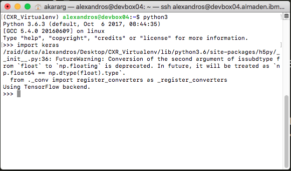
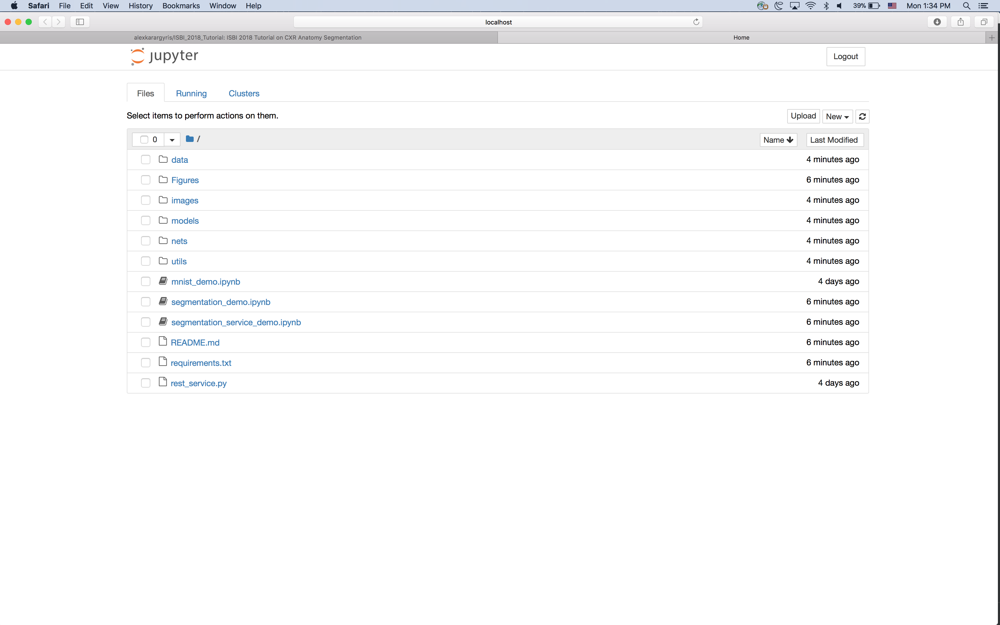

# Tutorial
ISBI 2018 Tutorial on CXR Anatomy Segmentation

- Intro to Deep Learning with Keras
- Anatomy segmentation with UNet architecture (e.g Keras layers in UNet, modelling, training, testing)
- Data loading, data generators, and image augmentation
- Training/Validation through generator 
- Callbacks (e.g. DICE score)
- Visualization

# Instructions

### Requirements
- A computer with Ubuntu/Mac/Windows operating system.
- High-speed internet access to download packages and repository
- Python 3.6 preferably, although it works with Python 2.7. 
> IMPORTANT!
> If you are using Windows machine, you need Python 3.6 since Tensorflow will not be able to install. We strongly recommend using your university's server or an AWS server with Linux instead. It comes with 750 hours of free computing: https://aws.amazon.com/ec2/
- VirtualEnv (see Linux/Mac instructions: https://virtualenv.pypa.io/en/stable/installation/, see example Windows instructions: http://timmyreilly.azurewebsites.net/python-pip-virtualenv-installation-on-windows/)

### Installation Steps

1. Create a folder e.g. `~/Desktop/Tutorial/` 
2. Download `requirements.txt` file from https://ibm.box.com/s/e8yhc80kqkfvfz6mbfnbwvcypnkz3944 and save it into the previous folder e.g. `~/Desktop/Tutorial/` 
3. Create a VirtualEnv (e.g. `ISBI-Tutorial-Environment`) . To learn how to create a VirtualEnv and understand more here: https://virtualenv.pypa.io/en/stable/userguide/#usage
4. Activate your new VirtualEnv. To learn how to activate see more here: https://virtualenv.pypa.io/en/stable/userguide/#activate-script
5. Now that you are inside your virtual environment go to your folder e.g. `cd ~/Desktop/Tutorial/` 
6. From the terminal run `pip3 install -r requirements.txt` if your VirtualEnv is running Python3 or  `pip install -r requirements.txt` for Python2 to install the libraries. That might take a few minutes.
7. Once finished, make sure Keras/Tensorflow work (see figure below) by running `python3` for Python3 users (`python` for Python2 users ) and then inside the interpreter run `import keras`. See figure below.

8. Type `exit()` to exit the python interpreter. 

### Post-Installation Steps

1. Download this project from Github (https://github.com/alexkarargyris/ISBI_2018_Tutorial/archive/master.zip) and unzip its files inside your folder e.g. `~/Desktop/Tutorial/`
2. Download the pretrained network with 10x10 kernels from here https://ibm.box.com/s/ane1j8h4g2ra1rookny1jz7gxwnjodxw and place it inside your folder `~/Desktop/Tutorial/`
3. Download the pretrained network with 2x2 kernels from here https://ibm.box.com/s/bh4dik59b3h37t184eidmtnmuxt3a2o8 and place it inside your folder `~/Desktop/Tutorial/`
4. With your Virtual Environment activated navigate to your folder e.g. `~/Desktop/Tutorial` and execute `jupyter notebook` . The browser should open to following screen.

